cat > README.md <<'EOF'
# AWS CloudWatch Log Monitoring and Alerting Project

## Project Overview

This project demonstrates how to monitor custom application logs from an AWS EC2 instance using Amazon CloudWatch.

A custom log file was created on EC2. CloudWatch Agent was configured to send logs from EC2 to CloudWatch Logs. A metric filter was created to detect ERROR log entries. When errors were detected, a CloudWatch Alarm changed to In alarm state and SNS sent an email notification.

---

## Architecture

```text
EC2 Custom Log File
        ↓
CloudWatch Agent
        ↓
CloudWatch Log Group
        ↓
Metric Filter
        ↓
CloudWatch Metric
        ↓
CloudWatch Alarm
        ↓
SNS Email Alert
```

---

## AWS Services Used

- Amazon EC2
- IAM Role
- CloudWatch Agent
- CloudWatch Logs
- Metric Filter
- CloudWatch Alarm
- Amazon SNS

---

## Project Steps

1. Launched an EC2 instance.
2. Created and attached an IAM role with CloudWatch permissions.
3. Installed CloudWatch Agent on EC2.
4. Created a custom application log file: /var/log/myapp/app.log
5. Configured CloudWatch Agent to send logs to MyApp-Log-Group.
6. Created a metric filter to detect ERROR logs.
7. Created a CloudWatch Alarm using the ErrorCount metric.
8. Configured SNS email notification.
9. Generated test ERROR logs and received an email alert.

---

## Screenshots

### 1. EC2 Instance Running
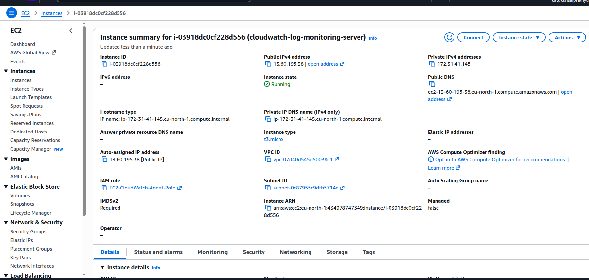

### 2. IAM Role Attached
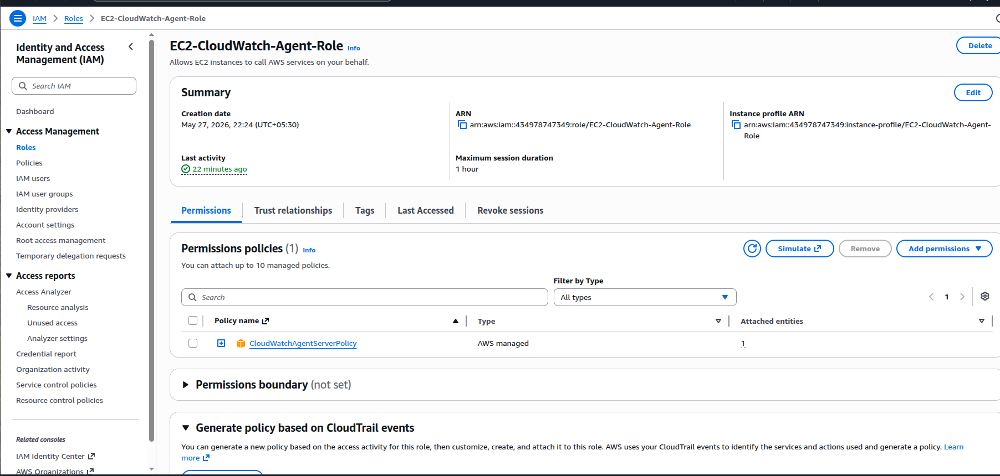

### 3. CloudWatch Agent Status
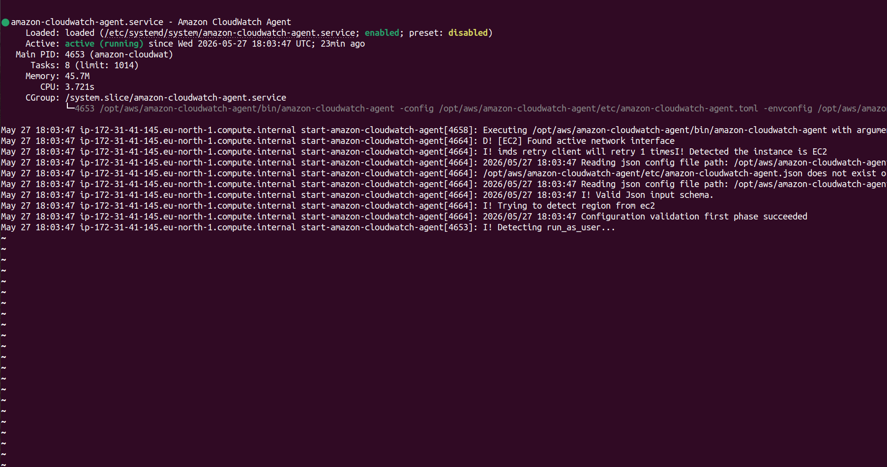

### 4. CloudWatch Agent Config
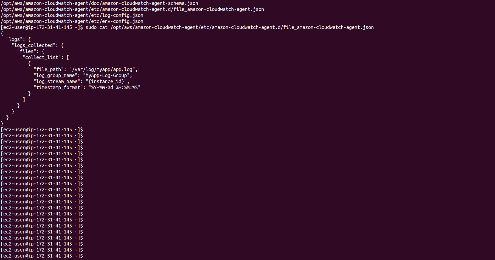

### 5. Custom App Log File
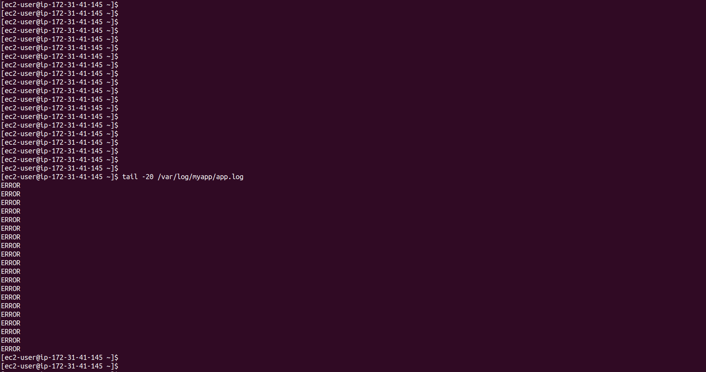

### 6. CloudWatch Log Group
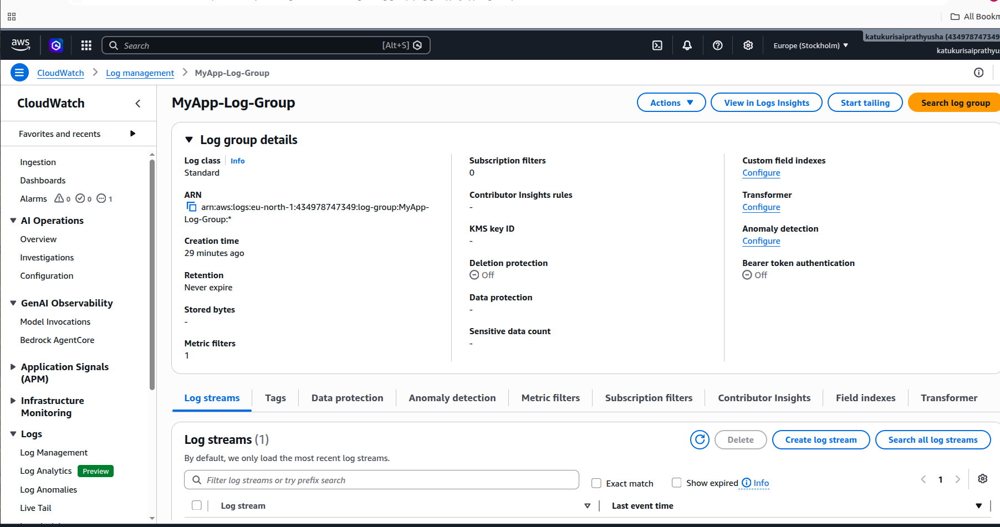

### 7. Log Stream Error Logs


### 8. Metric Filter
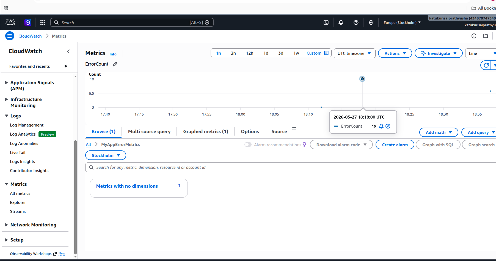

### 9. ErrorCount Metric
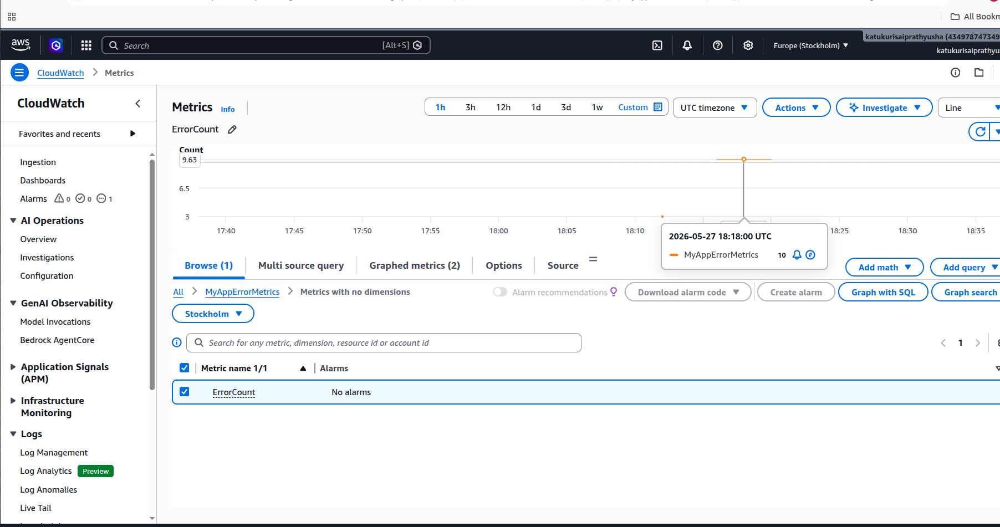

### 10. ErrorCount Metric Graph
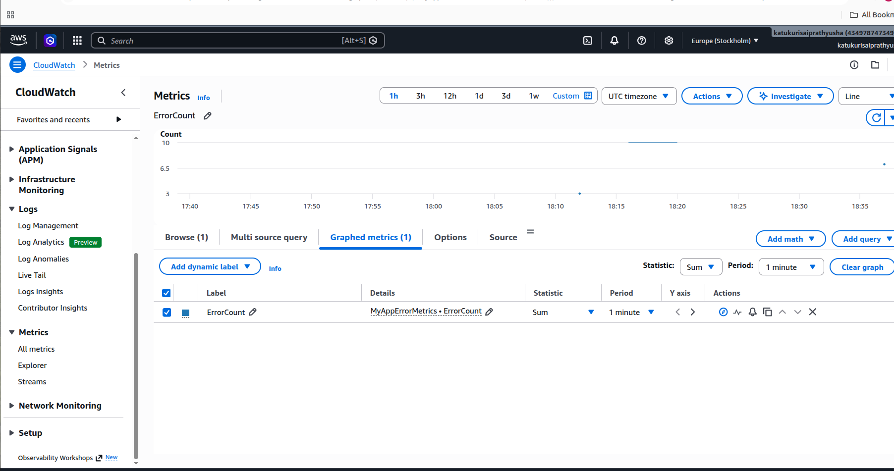

### 11. CloudWatch Alarm Configuration
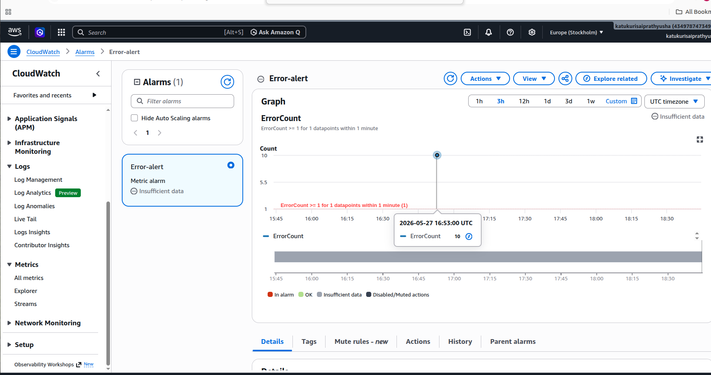

### 12. CloudWatch Alarm In Alarm State
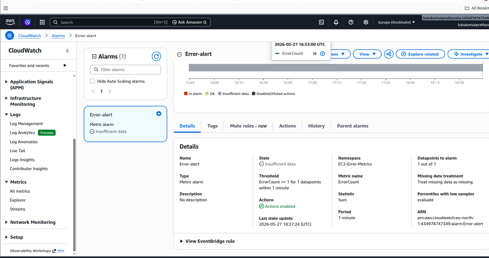

### 13. SNS Topic
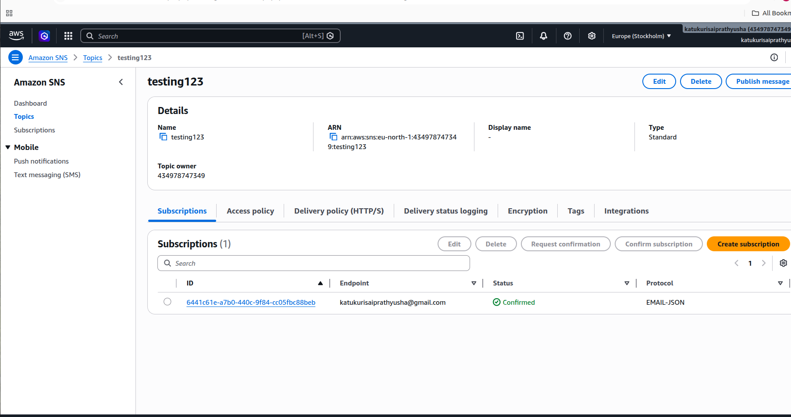

### 14. SNS Email Subscription Confirmed
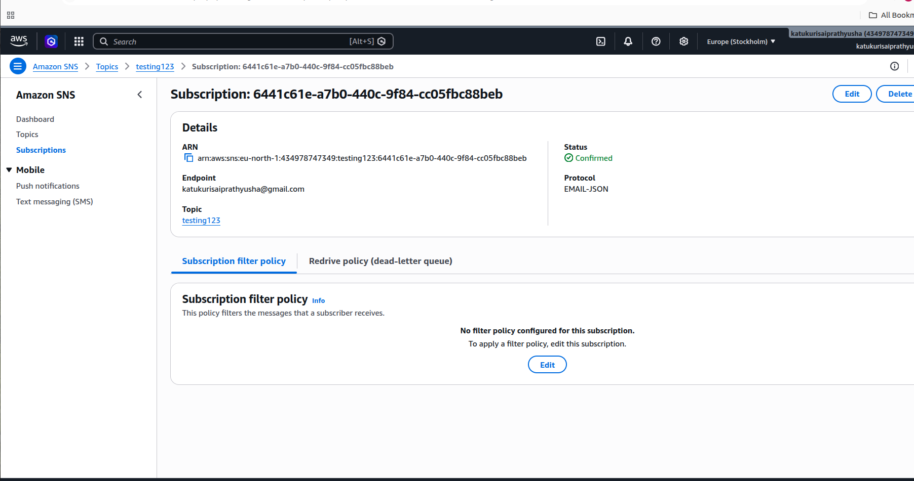

### 15. SNS Email Alert Received
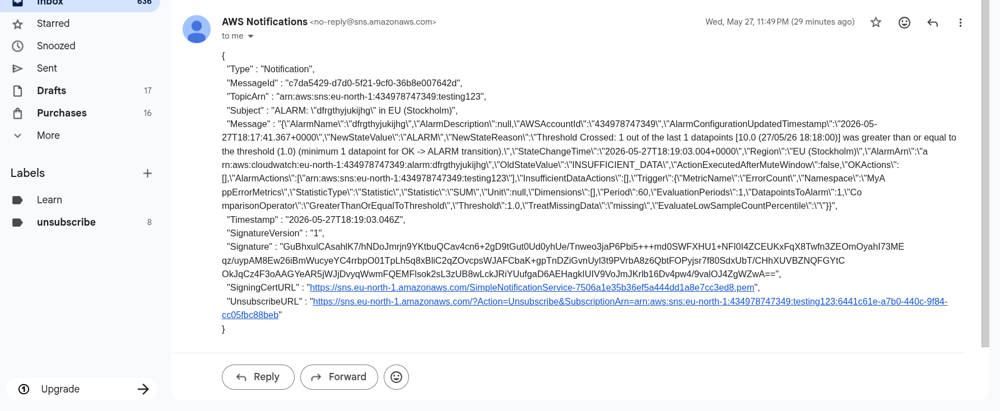

---

## Commands Used

### Create Custom Log File

```bash
sudo mkdir -p /var/log/myapp
sudo touch /var/log/myapp/app.log
sudo chmod 666 /var/log/myapp/app.log
```

### Add Test Logs

```bash
echo "INFO: app log started" >> /var/log/myapp/app.log
echo "ERROR" >> /var/log/myapp/app.log
```

### Check CloudWatch Agent Status

```bash
sudo systemctl status amazon-cloudwatch-agent
```

### Generate Error Logs

```bash
for i in {1..10}; do echo "ERROR" >> /var/log/myapp/app.log; sleep 2; done
```

---

## Troubleshooting

### Issue 1: Log Group Not Visible

Initially, the CloudWatch Log Group was not visible because /var/log/messages did not exist on the EC2 instance.

### Fix

I created a custom log file:

```bash
/var/log/myapp/app.log
```

Then I updated the CloudWatch Agent config to collect logs from this file.

### Issue 2: Alarm Showing Insufficient Data

The CloudWatch Alarm initially showed Insufficient data.

### Fix

I generated fresh ERROR logs after creating the metric filter and alarm. After metric data was generated, the alarm changed to In alarm.

---

## Final Outcome

- EC2 logs were collected successfully.
- Logs were visible in CloudWatch Logs.
- Metric filter detected ERROR logs.
- CloudWatch Alarm triggered successfully.
- SNS sent an email alert.

---

## What I Learned

- CloudWatch Agent installation and configuration
- Sending EC2 custom logs to CloudWatch Logs
- Creating metric filters
- Creating CloudWatch alarms
- Sending alerts using SNS
- Troubleshooting CloudWatch monitoring issues
EOF
